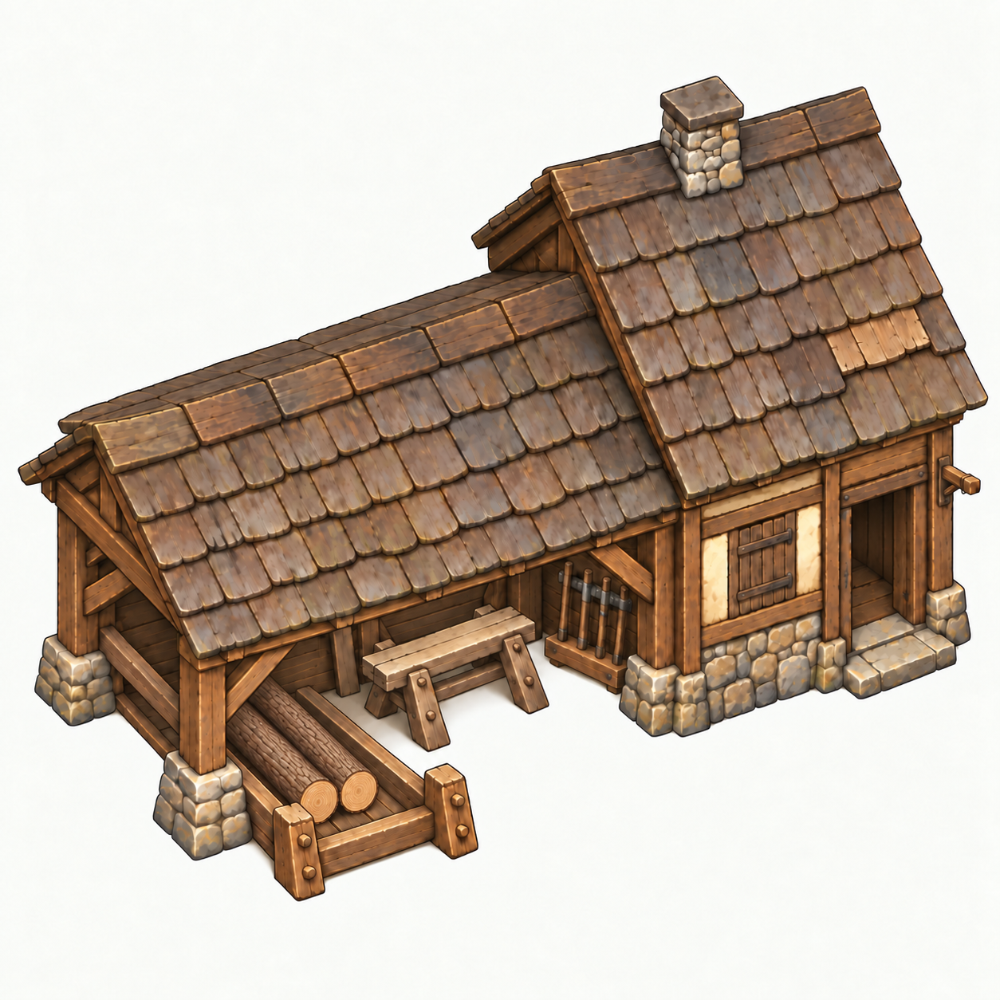
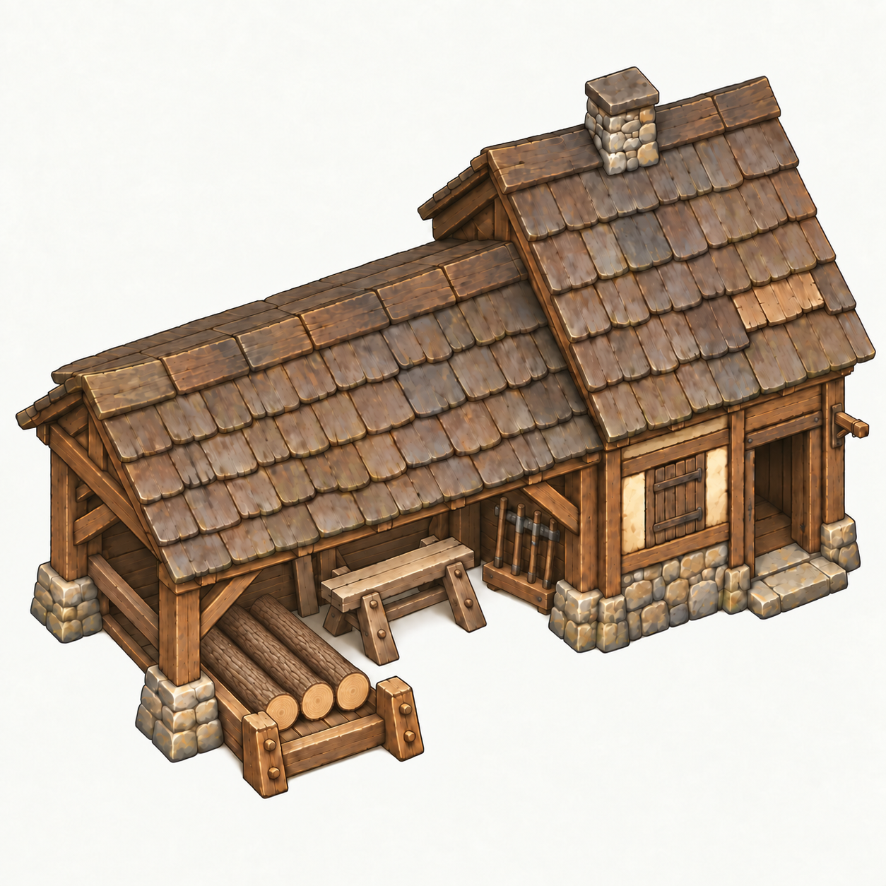

# Dřevorubecká chata v3 — zásoby 1 až 6 klád

Datum: **2026-09-09** · ID `lumber_hut` · výtvarný manuál **v0.2**.
Stav: **konceptové náhledy**, bez napojení na hru a bez produkční registrace.
Toto je historický záznam konceptové dodávky z 9. září. Samostatnou opravu
herního zobrazení zásob z **2026-09-10** vede
[integrační záznam zásob v1](lumber-hut-stock-v1-integration.md);
původní koncepty ani vzhled a stavební fáze chaty se touto opravou nemění.
Tento dodatek rozšiřuje [hlavní brief](lumber-hut-v3.md), který zachovává
geometrii, vstup, měřítkové cíle, vrstvy, zdroje dat a pravidla mlhy.
Původní [prázdný základ](../concepts/lumber-hut-v3.png) zůstává beze změny.

## Šest variant

| 1 kláda | 2 klády | 3 klády |
|---|---|---|
|  |  |  |

| 4 klády | 5 klád | 6 klád |
|---|---|---|
|  |  |  |

## Záměr a skutečná dodávka

- Stejná vlastní chata v předolevém nadhledu; zásoby v předním levém stojanu.
- Celé kulaté kmeny, hnědá kůra, světlá čela směrem k divákovi.
- Stavy 1–3 plní spodní řadu zleva; 4 přidá levou kládu druhé řady,
  5 druhou horní kládu a 6 horní střed: **3 + 2 + 1**.
- Přítomnost je nezávislá: dveře a prázdný závěs zůstávají stejné.
  Obrázky nevyjadřují skutečný obsazený/neobsazený stav domu.
- Dodáno šest celých sloučených PNG, každý **1254 × 1254, RGB bez alfy**,
  s původním světlým pozadím. Žádný výřez, přemalování kódem, změna rozměru
  nebo dodatečné zpracování obrazových dat.
- **Nejde o šest připravených herních snímků.** Horní klády stavů 4/5 jsou
  více zasunuté než odpovídající klády v 6. Vizuální podoba domu je konzistentní,
  pixelová shoda ani společné přesné kotvy nejsou garantované.
- Před nasazením vyrobit skutečné oddělené RGBA vrstvy nad prázdným základem,
  sjednotit polohy, průměry a délky klád, rozdělit překrývající sloupky,
  kalibrovat měřítko/práh a provést herní QA podle [manuálu](../building-style-guide.md).
- Mapy, simulace, herní kód a uložené hry nebyly změněny.

## Vizuální přejímka konceptu

| Kontrola | Výsledek |
|---|---|
| Počty jednotlivých čel 1 / 2 / 3 / 4 / 5 / 6 | Ověřeno vizuálně hlavním agentem i nezávislou kontrolou |
| Šest kusů má skladbu 3 + 2 + 1 | Ověřeno |
| Kamera, silueta, komín, nářadí, vstup a prázdný závěs | Vizuálně konzistentní |
| Opora klád ve stojanu, přístup ke dveřím | V konceptové velikosti čitelné a bez blokování dveří |
| Neměnná registrace klád mezi stavy | Nesplněno; zejména horní řada 4/5 |
| Skutečná transparentní alfa | Není součástí těchto RGB konceptů |
| Samostatné zásobní vrstvy / datové napojení | Neimplementováno |
| Čitelnost v herním měřítku, 0.75× / 1× / 2.4× | Neprovedeno |
| Den/noc, mlha, stavba, předání/vyzvednutí, save/load | Neprovedeno; žádná změna runtime |
| Uživatelské schválení / etalon sady | Zatím ne |

## Původ a přesná zadání

Použit skill **imagegen**, výchozí vestavěný obrazový nástroj, nikoli CLI/API fallback.
Model nebyl nástrojem výslovně identifikován.
[Přesná zadání, vstupy, výstupy a SHA256](lumber-hut-v3-stock-prompts.json).

Nejprve vznikl šestikusový master úpravou našeho prázdného v3. Stavy 1–4
vznikly odebíráním klád s prázdným v3 jako obnovovacím podkladem. První pokus
pro 5 kusů chybně obsahoval šest; byl odmítnut a do projektu není přibalen.
Finální 5 vznikla přidáním dvou klád do ověřené varianty 3.
V tomto kroku nebyl použit žádný nový proprietární obrázek.
Původ a dřívější referenční role KaM jsou uvedeny v [historii základu](lumber-hut-v3-production.md).
