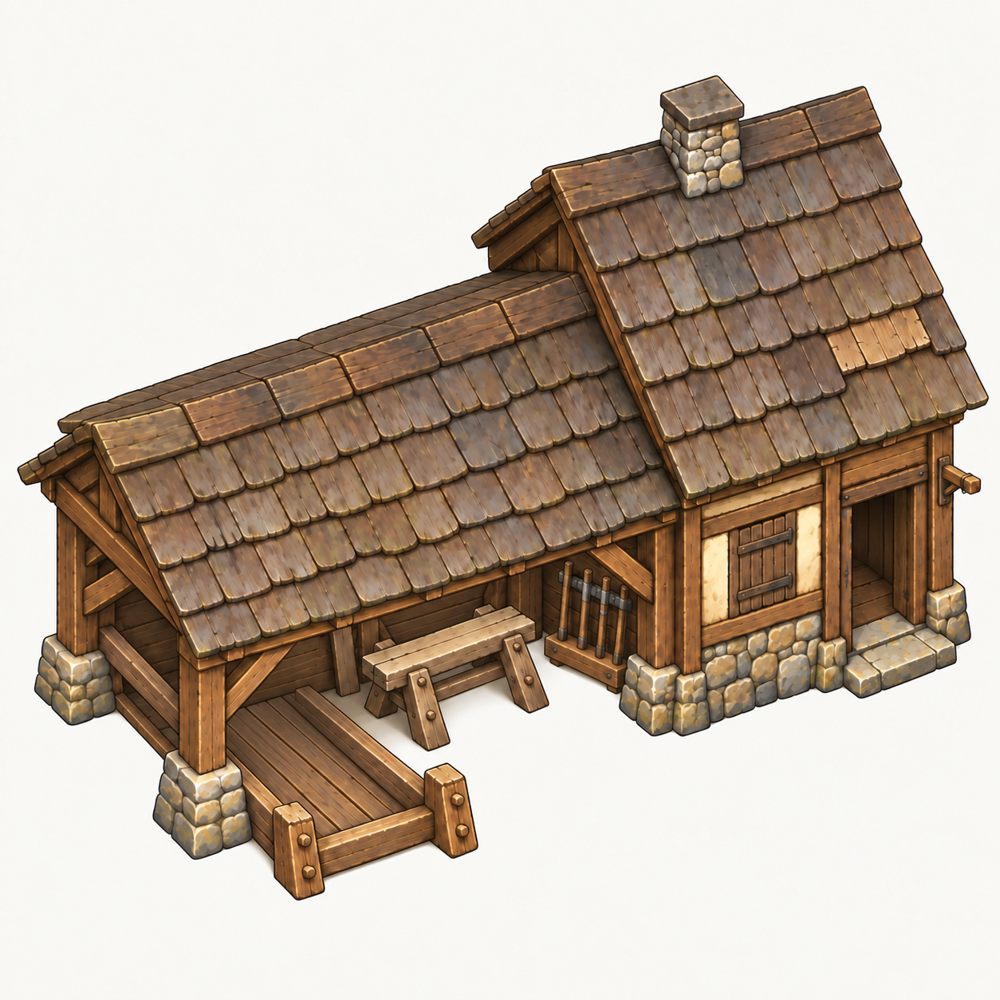

# Dřevorubecká chata v3 — vyvýšený předolevý koncept

Datum: **2026-09-09** · ID: `lumber_hut` · [manuál v0.2](../building-style-guide.md).
Stav: **koncept k posouzení**, ne herní pilot ani schválený obrazový etalon.
Uživatel zvolil první realizaci dřevorubce a výslovně opravil čelní pohled
na mírně izometrický zleva; následně požádal i o vyšší nadhled podle KaM.

## Úloha a vlastní architektura

Dřevorubec kácí stromy a fyzicky přináší klády. Lesní řemeslná rodina,
nikoli školkařská chata zahradníka. Naše stavba má širší nízký pracovní
přístřešek vlevo a vyšší uzavřenou chatu vpravo. Sjednocují je teplé kamenné
patky, široké dřevěné trámy/prkna, krémová výplň a matný šedohnědý šindel.
Záměrné stopy používání: lokálně vyměněný šindel, drobné opravy a ošlapaný práh.

- Hlavní profesní motiv: otevřený dřevorubecký pracovní a skladovací přístřešek.
- Podpůrné motivy: trvalý řezací kozel a držák seker.
- Sazenice patří budoucímu lesníkovi; tato chata je nemá.
- Pracovní špalek byl z poslední verze odstraněn, protože zabíral místo zásob.
- Z KaM přebíráme prostorovou čitelnost a atmosféru, ne zelenou střechu,
  roubenou hmotu, vlajku, pracovníka nebo původní rozmístění vybavení.

## Pohled a registrace

Při kontrole skutečného původního obrázku je patrný nadhled a čitelné horní
plochy. V3 proto ukazuje více střechy, levý bok a vršek pracovního vybavení,
nikoli převážně čelní nárys V1. Nejde o tvrzení o pixelové shodě nebo přesně
změřených úhlech původní kamery. Pozdější kontrola ve hře je stále nutná.

Aktuální herní geometrie z katalogu a helperu:

- Maska `### / ##E`, půdorys **3 × 2**, šest obsazených polí.
- Kotva levé dolní pole; dveřní pole vůči kotvě (2,0), venkovní vstup (2,1).
- Práh: `terrain.project_grid_position(Vector2(door_cell) + Vector2(0, 0.5))`.
- Podklad 120 × 80 world px při 1×; terénní síť 40 × 40, výška −8 px/úroveň.
- Referenční běžný člověk má cíl 33 world px. **Dveře, celý objem, vizuální
  půdorys a přesahy tohoto konceptu ještě nejsou herně měřítkově ověřeny.**
- Natočení artworku neotáčí simulaci ani masku. Při kalibraci nesmí stojan,
  patky či okap blokovat volná pole nebo pravý jižní přístup.
- Alfa výběr, starší půdorysy, mlha, lešení i srovnávání terénu čekají
  na budoucí implementaci; nejde o již dokončenou kompatibilitu.

## Stavový plán připravený návrhem

Základní kresba ukazuje prázdný stojan vlevo vpředu. V prostoru zásob není
napevno nakreslená kláda, pracovní špalek ani jednotka. Řezací kozel zůstává
za stojanem; obraz nebude předstírat zásoby prostřednictvím dekorace.

| Budoucí prvek | Zdroj / význam | Výtvarné místo |
|---|---|---|
| Jednotlivé klády | `building.outputs.get("log", 0)` | Prázdný stojan vlevo vpředu |
| Přesný počet | Stejný inventář, ne rezervace či nesené zboží | Samostatný čitelný text u stojanu / nad domem |
| Přítomnost ano/ne | Někdo z `world.workers` má `inside_building_id == building.id` | Malý samostatný znak na závěsu u pravých dveří |
| Činnost | V budoucnu samostatný skutečný pracovní stav | Není zaměněna za přítomnost |

Dnešní kapacita `output_capacity` je **6**. Návrh počítá s přesnými stavy
0–6 (skladbou 3 + 2 + 1). Dne 2026-09-09 byly na další požadavek uživatele
vytvořeny [konceptové varianty 1–6 klád](lumber-hut-v3-stock.md).
Přesná registrace samostatných klád a kontrola při 1× zůstávají nedokončené. Číst aktuální kapacitu z dat; při změně mapování
překalibrovat, nikoli tiše ořezat údaj. Nula skutečně vyprázdní stojan.
Příchozí rezervace, kláda v rukou nosiče a globální zásoby do počtu nepatří.

Přítomnost neznamená přidělení dřevorubce: může být venku, na cestě nebo jíst
jinde. Naopak spící či pozastavený pracovník může být uvnitř. V tomto konceptu
je pouze prázdný závěs, žádný již aktivní znak; prázdný koncept není runtime
tvrzení „nikdo uvnitř“. Přítomnost nebude automaticky vyjádřena kouřem,
hořícím oknem nebo napevno namalovaným člověkem.

## Vrstvy a kotvy — plán, nikoli dodané soubory

1. Prázdná budova a zadní konstrukce skladovacího stojanu.
2. Samostatně přidávané skutečné klády.
3. Přední sloupky a lišty pro správné zakrytí klád.
4. Samostatný ukazatel přítomnosti.
5. Volitelný čitelný počet kreslený herním UI, ne zapečený v textuře.

Všechny budoucí vrstvy musí mít shodný canvas, měřítko a registraci; tato
dodávka je zatím **jediná sloučená konceptová bitmapa**. Oddělené vrstvy,
masky a log-sprity neexistují. Povinné budoucí kotvy: `door_threshold`,
`stock_origin`, `log_slot_1…6`, `occupancy_indicator`, `stock_count_label`.
Pixelové souřadnice, alfa meze a škálování do hry dosud **nezměřeny**.
Závěs, práh a stojan určují pouze viditelná zamýšlená místa v konceptu.

Viditelnost respektuje herní práva: známá silueta cizího domu v mlze
nesmí odhalovat jeho živé zásoby ani skryté obyvatele. Skrytý stav není
potvrzená nula/nepřítomnost. Materiály zásob se tónují jako dům, všechny
světové vrstvy podléhají správnému řazení a mlze. Nedokončené stavby
neukazují hotové produkční zásoby. Globální pauza nesmaže stav.

## Dodávka, původ a ověření

- [Finální koncept](../concepts/lumber-hut-v3.png): **1254 × 1254, RGB PNG
  bez alfy**, světlé pozadí. Originální výstup zkopírován beze změny.
- SHA256: `35c287bf83ceaeb905a20939c736a765392e9434a348696df325df659194674b`.
- Výroba: vestavěný **imagegen**, model nástroj výslovně neidentifikoval.
- [Skutečná zadání, všechny vlastní vstupy a historie](lumber-hut-v3-production.md).
- [Původní KaM reference](https://www.knightsandmerchants.net/information/buildings)
  prohlédnuta a při vyšší kamerové revizi použita pouze jako pohledový podklad.
- Ověřeno obrazově: předolevý nadhled, horní plochy, vlastní dvouhmotová
  stavba, prázdný stojan, neucpané viditelné dveře a prázdný závěs.
- **Neověřeno:** 1×/0.75×/2.4× ve hře, proporce s člověkem, rovina/vyvýšený
  základ, den/noc, výběr/překrytí/mlha, stavba, ukládání, všechny kombinace
  0–6 klád × přítomnost, fyzické předání/odebrání, spánek/pauza.
- Alfa požadavek nesplněn. Předchozí pokusy vrátily namalovanou šachovnici,
  proto byl vyroben pravdivě označený koncept na světlém pozadí. To není
  hotový produkční sprite; před integrací je nutný skutečný RGBA export.
- Tato revize **nemění herní kód, mapy ani uložené hry** a nezavádí statusy.
- Konkrétní obraz ani kamera nejsou uživatelem schváleny; etalon sady: **ne**.

## Doplnění 2026-09-09 — konceptové množství zásob

Na požadavek uživatele vzniklo šest samostatných náhledů s 1 až 6 kládami.
[Galerie a kontrola](lumber-hut-v3-stock.md) · [přesná zadání a původ](lumber-hut-v3-stock-prompts.json).
Původní prázdný základ v3 zůstává beze změny; zásoby jsou v nových náhledech
sloučené s domem, nikoli dodané jako transparentní vrstvy. Počty jsou ověřené.
Horní kláda ve stavu 4 a horní dvojice ve stavu 5 jsou trochu zasunuté oproti
šestce; pro herní přepínání je nutné sjednotit kotvy. Kamera a dům jsou vizuálně
konzistentní, nikoli prokázaně pixelově totožné. Nejde o herní integraci ani
uživatelem schválený etalon. Ukazatel přítomnosti nebyl změněn.

## Doplnění 2026-09-10 — stavební herní pilot

Na další výslovný požadavek uživatele vzniká z tohoto původního konceptu
[stavební sada v1](lumber-hut-construction-v1.md): vlastní průhledné kresby
a 12 + 21 kroků stavby ve hře. Aktuální implementaci, registraci, původ
nových podkladů a herní QA vede tento nový brief. Výše popsaný koncept
v3 z 9. září zůstává původním RGB podkladem a nebyl zpětně přepsán.
Schválení etalonu celé sady ani integrace stavových klád/přítomnosti
z tohoto rozšíření nevyplývají.
