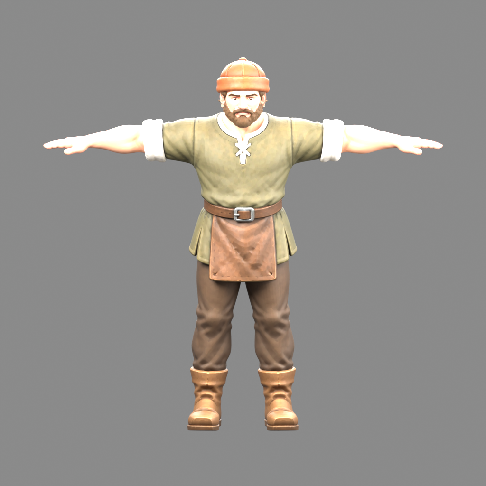
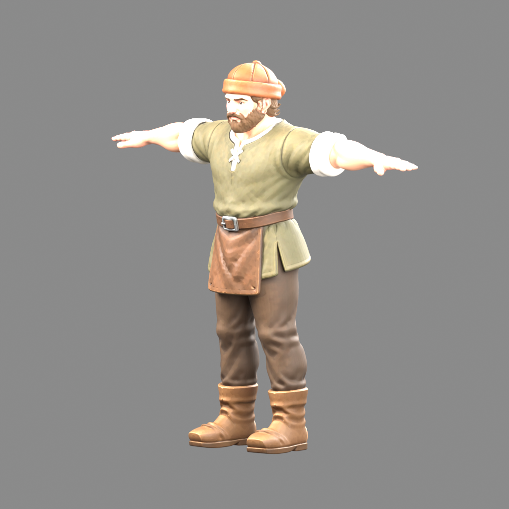
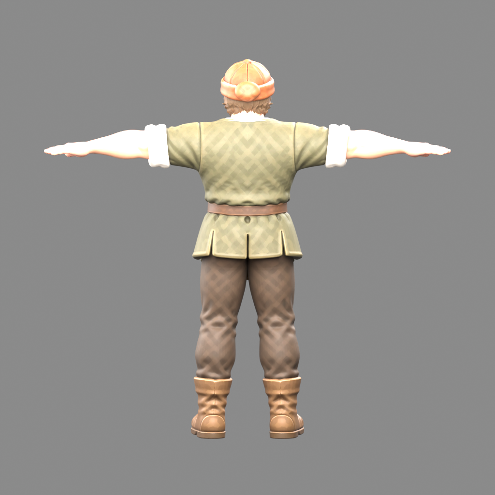
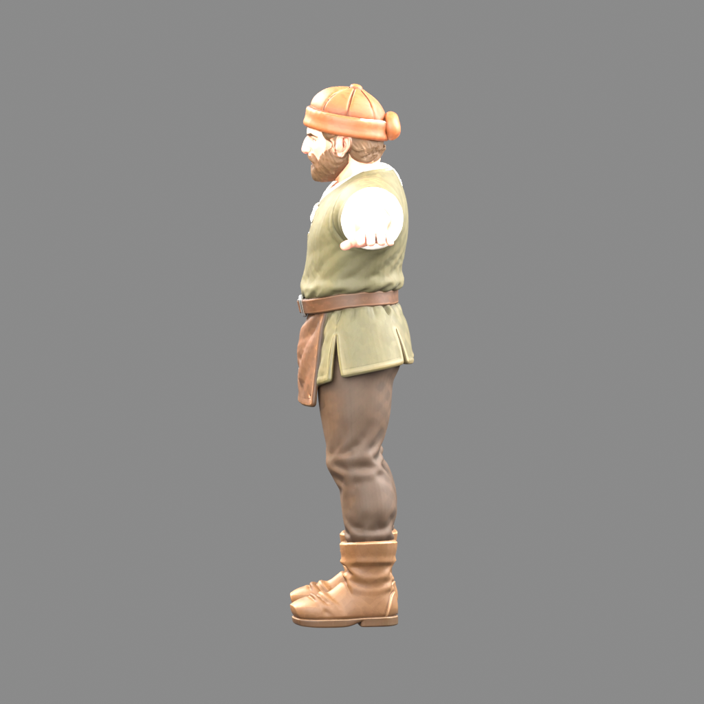

# Static lumberjack — Blender QA

Source: `/Users/openclaw/AI-Projects/medieval-economy-rts/docs/art/models/lumberjack-meshy-v1/source/Meshy_AI_Medieval_Craftsman_0910054251_texture.glb`
SHA256: `123bfdb63341390146c5ee02bf193bada124b04ff5cf58c414d588a818959d44`

This is a static model audit. No rig, walk cycle, engine integration, or approval is claimed.

- Mesh objects: 1
- Vertices: 1,005,879
- Triangles: 1,944,012
- Materials: 1
- Imported images: 3
- Armatures: 0
- Source skins: 0
- Source animations: 0

## Texture maps

- 0: pbrMetallicRoughness.baseColorTexture, pbrMetallicRoughness.metallicRoughnessTexture, normalTexture

## Observations requiring visual review

Check identity, face, fingertips, separate legs, front-only apron, rear tunic, cap silhouette, empty hands, and texture seams.
Imported material nodes and image color spaces are listed in audit.json; no material maps were replaced or discarded.

- No armature: expected for this requested static T-pose; this model is not yet rigged.

Camera front assumption: -Y; elevation 6.0°.

### front

### threequarter

### back

### side

Source unchanged: True
Status: audit complete; visual review required
