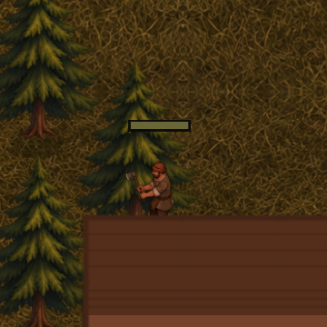

# Běžná hra — finální přirozený pracovní cyklus

**2026-09-10: prošlo.** Nový nativní proces prošel produkčním menu
**Nová hra → Osídlené údolí → Spustit mapu** a nechal původního dřevorubce
skutečně vytěžit a doručit kládu. [Report](report.json) a [nativní log](run.log)
obsahují **7 fází, 17 fázových PNG, 60 skutečných snímků sekání, 0 chyb**;
kontrola skutečně kreslených stínových polygonů je rovněž bez nálezu.

Ukázka je bezeztrátový výřez 360 × 360 z nativních obrázků 1280 × 800.
Zachovává pořadí a skutečné simulační rozestupy všech 60 zachycených snímků.
Pozorovaný úsek je 0.919546–2.619262 s; délka ukázky včetně poslední výdrže
je 1.726588 s. Opakuje se výňatek hraní, nikoli nově vytvořená bezešvá smyčka.
[Exportní záznam](chop-excerpt.apng.json) doložil přesnou shodu barevných pixelů
i pořadí všech 60 dekódovaných snímků. Původní PNG zůstávají nezměněna.

| Skutečná událost | Tick | Důkaz |
|---|---:|---|
| Chůze k vlastnímu stromu, `walk_axe/W` | 2 | [Detail](03-walk_axe-2_4x.png) |
| Začátek / střed / konec rozpracované těžby | 8 / 22 / 33 | [Začátek](04-chop-start-2_4x.png), [střed](05-chop-middle-2_4x.png), [konec](06-chop-end-2_4x.png) |
| Převzetí skutečné klády | 38 | [Detail](07-picked-log-2_4x.png) |
| Zpáteční chůze, `walk_log/E` | 39 | [Detail](08-walk_log-2_4x.png), [běžný zoom](08-walk_log-1x.png) |
| Doručení a skutečný pobyt uvnitř chaty | 94 | [Chata po doručení](09-delivered-2_4x.png) |

Worker **19** má vlastní dokončenou chatu **2** a těží strom **13**. Množství
stromu se změnilo **5 → 4**, pracovník převzal jednu kládu a výstup jeho chaty
poté **0 → 1**. Po doručení má prázdné ruce a `inside_building_id = 2`;
správně vypadl z draw listu. Nesená kláda používá logový klip a potlačuje
obecnou značku nákladu. Pauza v každé zachycené fázi zachovala tick i snímek.

Prohlédnut byl [přehled všech 17 fázových PNG](phase-contact.png), samostatné
detaily kontaktu, převzetí klády, návratu a doručení a celý
[kontaktní arch 60 skutečných pozorování](chop-burst-contact.png). Pracovník
stojí vpravo od kmene; sekera W v dolní fázi zasahuje jeho dolní část.
Je čitelný nápřah, úder a návrat jedné sekery, následovaný začátkem dalšího
cyklu. Na běžném zoomu zůstává rozpoznatelná silueta a kláda, jemný úchop
je drobný. Část rukou zakrývá tělo a boty zakrývá sousední střecha;
kontakt chodidel se proto přejímá v [oddělené vizuální sadě](../visual/README.md).

Simulační zem při práci zůstává `(3, 13)`. Výtvarná a stínová kontaktní zem
je `(3.25812888, 12.99862003)`, projektovaná kotva
`(150.32514954, 539.94482422)` světových px. Jde o stabilní pracovní postoj,
nikoli posouvání podle obalu každého snímku. Přechody používají původní
simulační pohyb. Nevznikla změna tras, práce, zásob ani uloženého formátu.

Podmínky: Godot 4.7.2, Apple M4, OpenGL 4.1/Metal Compatibility, nový proces,
výstup 1280 × 800, herní zoomy 1× a 2.4×, přirozený úsvit 05:00–05:22
a původní mlha mapy. Hudba N/A — projekt nemá přehrávače; Master ani SFX se
neměnily. Nepoužil se hráčův save; session měla izolované dočasné cesty,
do nichž také nic nezapsala. Zdrojové pixely assetů nebyly upraveny.

Report uvádí SHA-256 skutečného balíku a osmi skriptů při startu; shodují se
s finálním rendererem použitým oddělenou vizuální sadou. Předchozí neúspěšné
běhy zůstávají jako diagnostická historie. Jejich stínové chyby odstranilo
kreslení lokálních bodů s původním počátkem; tento běh je ověřil na skutečné
geometrii bez odřezávání platných drobných stínů.

[Rychlý běh 4×](../natural-fast4x/README.md) nezávisle dokončil stejný skutečný
cyklus bez snímků. Všechny směry, noc, svahy, mlha, klikání a výkon mají
vlastní rozsah v [hlavním QA záznamu](../README.md); tento přirozený běh je
nevydává za své uměle nastavené stavy ani za schválení výtvarného stylu.
