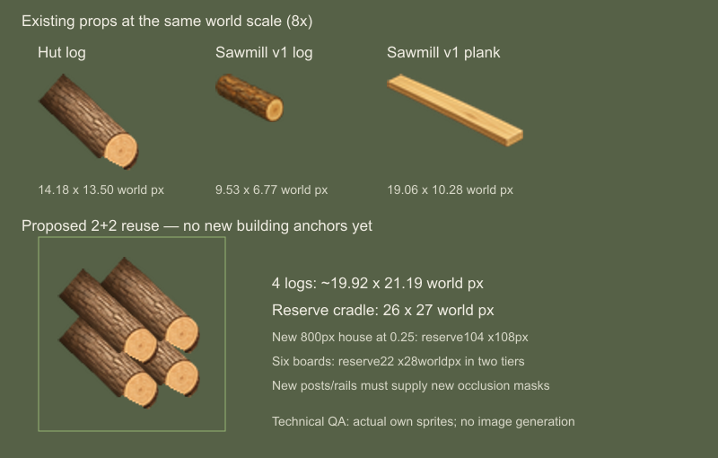

# Pila v2 — měřítko zásob před novým masterem

Datum **2026-09-12**. Izolované měření a návrh prostoru, bez změn runtime,
produkčních assetů v1 nebo nové obrazové generace. Uživatel schválil
přepracování pily do vyššího předolevého nadhledu a materiálové kresby
dřevorubecké chaty, včetně srovnatelné velikosti klád. Tento záznam neoznačuje
dosud nevytvořenou pilu v2 za výtvarně nebo herně ověřenou.

Autority: [zásoby chaty](../../../../game/art/buildings/lumber_hut/v1/stock/manifest.json),
[zásoby pily v1](../../../../game/art/buildings/sawmill/v1/operation/stock/geometry.json),
[provozní manifest](../../../../game/art/buildings/sawmill/v1/operation/manifest.json),
[pracovník](../../../../game/art/buildings/sawmill/v1/operation/work/worker-geometry.json)
a [dosavadní přímé porovnání budov](../sawmill-lumber-hut-comparison-2026-09-12/README.md).
Skutečné hodnoty a hashe vede [měření](measurements.json).

## Závěr pro nový dům

Použít přesnou vlastní malovanou kládu chaty, vyjmutou ze stejného zdroje
a polygonu jako současný exporter chaty. Při 800² canvasu a novém měřítku
**0,25 world px / px** vyhradit prázdné vstupní lože **104 × 108 px**
(26 × 27 world px) pro kompaktní skladbu **2 + 2**. Pravý regál pro šest
prken potřebuje přibližně **88 × 112 px** (22 × 28 world px).
Jde o rezervaci prostoru v konceptu, nikoli finální absolutní polohu nebo
hotovou masku nové budovy.

## Skutečné rozměry

Měřeno z dekódované alfy při prahu **alpha > 25**, meze vlevo/nahoře
včetně, vpravo/dole výlučně. Pro srovnání je rozhodující world rozměr,
nikoli velikost obou PNG canvasů. JSON obsahuje navíc prahy 0 a 127.

| Kresba | Alfa obal v jejích px | World px |
|---|---:|---:|
| Jedna kláda chaty | 63 × 60 | 14,175 × 13,500 |
| Čtyři klády chaty ve staré skladbě 3 + 1 | 114 × 87 | 25,650 × 19,575 |
| Šest klád chaty 3 + 2 + 1 | 114 × 114 | 25,650 × 25,650 |
| Jedna kláda pily v1 | 38 × 27 | 9,530 × 6,772 |
| Jedno prkno pily v1 | 76 × 41 | 19,061 × 10,283 |

Chata používá 0,225 world px na produkční pixel, pila v1 0,2508. Kláda
pily je tedy jen 67 % šířky a 50 % výšky stejného zboží u chaty. Konce
klád chaty mají přibližně 4,7 × 5,6 world px; jde o pohledový odhad ze
silhuety zdrojového řezu, nikoli odhad reálných metrů.

Původní kláda chaty ubíhá zhruba pod obrazovým úhlem 42° dolů doprava,
kláda pily v1 kolem 28°. Tato čísla popisují osu nakresleného kusu,
**nejsou to odvozené 3D úhly kamery**. Vedle rozdílné velikosti se liší
tedy i kreslené usazení do prostoru. Zvětšení v1 nebo nestejnoměrné
protažení by samo nesladilo pohled a materiál.

## Čtyři klády 2 + 2

Jedna převzatá kláda zabere přibližně **56,7 × 54 px** v nové pile.
Relativní kotva je vždy střed čelního řezu, ne spodní roh alfa obalu.
Posuny vycházejí z existující rozteče čelních řezů chaty a jejího zdroje
1254²; druhá dvojice je přímo nad první, aby fronta zůstala úzká.

| Pořadí kusu | Posun kotvy ve world px | Posun v novém canvasu |
|---|---:|---:|
| Dolní levý / bližší | 0; 0 | 0; 0 |
| Dolní pravý | +5,742; −1,608 | +22,967; −6,431 |
| Horní levý / bližší | 0; −6,086 | 0; −24,344 |
| Horní pravý | +5,742; −7,694 | +22,967; −30,775 |

Společný konzervativní alfa obal je **19,917 × 21,194 world px**, tedy
asi **79,67 × 84,78 px**. Směr dolní řady má sklon **−0,28**, souhlasný
s novým čelním okapem a trámy. Zbytek rezervovaných 26 × 27 world px je
pro boční podpěry, příčnou lištu a odstup konců od sloupků. Lože potřebuje
věrohodně držet dvě svislé dvojice; konce všech čtyř kusů mají zůstat čitelné.
Horní i dolní klády jsou proměnlivé vrstvy a nesmějí být v domě namalované.

Export půjde ze stejného vlastního zdroje
`docs/art/concepts/lumber-hut-v3-stock/logs-6.png` a `extraction_polygon`
z manifestu chaty. Přepočet původního zdroje je `640/1254 × 0,225`
world px na zdrojový pixel. Až bude hotový dům, z tohoto zdroje vytvořit
samostatnou RGBA kládu s měřeným trimem a čelní kotvou. Neskládat produkci
ze zvětšeného drobného PNG pily v1.

## Šest prken

Pro v2 je předběžný cíl **13,5 × 11 world px** na prkno (54 × 44 px
domu), s podélnou osou podobnou kládám a viditelnou horní plochou.
Čelní krátká hrana regálu má stoupat doprava ve směru **−0,28**.
Rozměr je návrh k ověření nad novým masterem, nikoli měření nové kresby.

Doporučené dvě police po třech kusech: svislý krok jednotlivých prken
0,9 world px, mezi odpovídajícími pozicemi polic 9,2 world px. Relativní
Y slotů `0; −0,9; −1,8; −9,2; −10,1; −11` dává společný obal přibližně
13,5 × 22 world px. Rezervace 22 × 28 world px ponechá místo mohutným
sloupkům a nosníkům. Není nutné generovat šest samostatných obrazů;
jedna správná vlastní RGBA deska stačí pro šest měřených slotů.

V1 prkno má čelnější a širší projekci než zamýšlený materiál v2. Po
vytvoření domu preferovat nový samostatný pohled prkna, jehož případnou
vlastní materiálovou referencí může být nezměněný high-res master v1.
Pouhé stlačení či otočení současného produkčního PNG není oprava kamery.

## Pracovník a integrace po masteru

Současných šest pracovních póz lze nejdříve zkusit beze změny: zachovat
33 world px výšky, zdrojových 412 px a společná chodidla `[374.5,489]`.
Rozpětí bot je přibližně 15,22 world px. Kresba již ukazuje vršek vlasů,
část ramen a horní plochy bot; toto měření samo nedokazuje potřebu nové
postavy. Prostorově je nejdříve nutné ověřit kontakt rukou, listu a klády
na novém stole. Jeho stará téměř vodorovná zubová hrana a hlavně vodorovný
posuv se nesmějí mechanicky ztotožnit se směrem každého trámu nového domu.

Pokud až skutečný kompozit ukáže nedostatečný nadhled, rozsah případné
opravy je sada pracovních póz ve vyšším pohledu a konzistentní odpočinkový
pohled stejné identity, následované novou registrací. Nedělat automaticky
osm směrových jednotek ani měnit výšku člověka. Nyní se nic negenerovalo.

Nový master určí absolutní stock kotvy, fyzické podpěry a masky. Starý
foreground pily v1 a jeho SHA patří výhradně ke starému domu. Po v2 exportu
znovu změřit nové sloupky a přední lišty, zachovat volné dveře a všechny
kontakty uvnitř 4 × 2 footprintu. Při kreslení zásob zachovat existující
zdroje `inputs.log`, `outputs.plank` a samostatnou rozpracovanou kládu;
změna obrazu nemění kapacity, proces, fyzickou přítomnost ani mlhu.

Reprodukce měření: `measure-props.cjs` s projektovým Node + Sharp.
Jde o odečty vlastních existujících PNG a izolované technické kompozity.
Tento preflight nespouští a nenahrazuje testování nové budovy v běžné hře.
