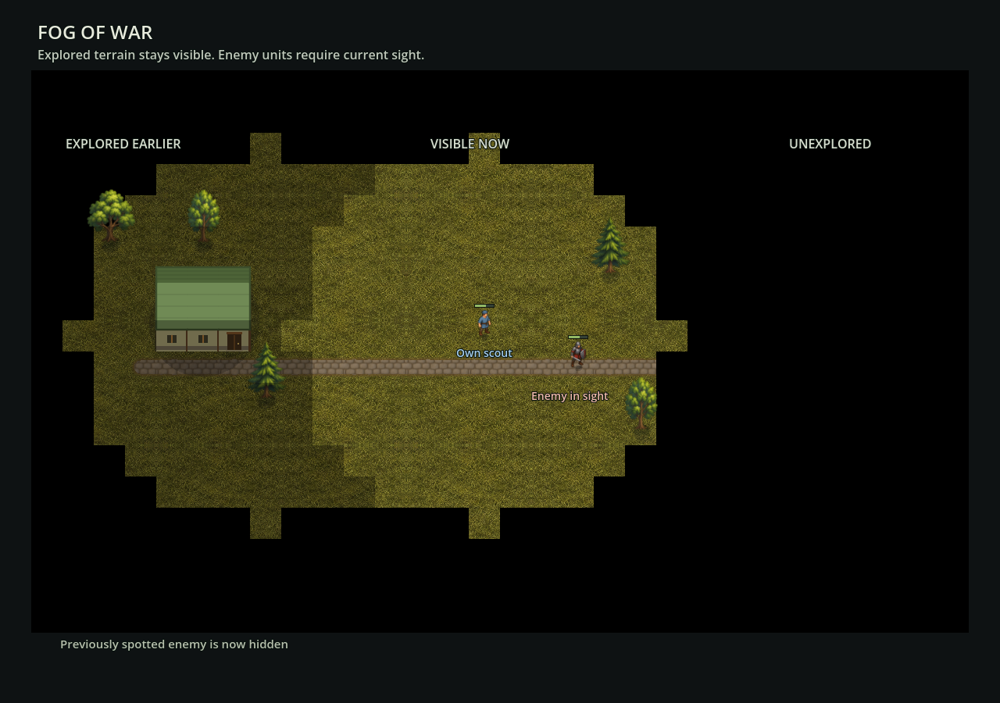

# Fog of war — 2026-09-07

New playable games start with three knowledge states:

- **Unexplored:** black terrain, no objects or map details exposed.
- **Explored:** discovered terrain and static objects remain visible under a
  light darkening; foreign units disappear outside current sight.
- **Visible:** terrain and units are shown normally.

Local outdoor citizens provide circular sight of six cells. Completed local
buildings also provide six cells, measured from their footprint center;
Watchtowers provide nine. Indoor citizens do not create separate observers,
and unfinished buildings do not remotely reveal land. Leaving, entering or
losing an observer updates current sight without forgetting explored cells.
This first version uses radius-based sight, without wall/height ray blocking.

## Gameplay and information boundaries

All ordinary new-game routes enable fog, including the canonical Mountainous
Region starter. The graphics sandbox and terrain-only developer imports remain
survey views. Units reveal ground as they move; moving the camera is not scouting.
Construction requires the complete footprint and entrance to be explored.
Unknown placement reports no underlying height, resource, occupancy or slope.

Foreign units outside sight have no sprite, shadow, cargo, condition marks,
hit target or retained inspector selection. Own selected workers remain
inspectable while indoors. Foreign building inventory and control actions are
not exposed. Settlement stocks and citizen summaries count local ownership.

`owner_id` distinguishes player 1 (the existing settlement), neutral 0 and
other owners through 16. This change supplies visibility and ownership
boundaries; it does **not** add enemy armies, enemy economic AI, combat,
diplomacy or shared allied vision. Foreign scenario entities remain inert.

## Persistence

Save **v18** stores ownership, local player, the enabled flag and a sorted,
bounded list of explored cells. Current visibility is rebuilt from actual
sources on loading, never trusted from a saved mask. Invalid fog/owner data
is rejected transactionally without changing a live world.

Pre-v18 games previously exposed the whole map. Loading them in gameplay
therefore preserves the entire terrain as explored, then enables only current
local sight. A raw authoring load remains disabled until gameplay activation.
Deliberately fog-disabled v18 fixtures remain disabled. Starting a new game
clears old discoveries; restarting or loading does not overwrite a saved slot.

## Rendering and performance

`fog_of_war.gd` caches observer signatures, publishes only changed cell states
and keeps eight bounded revision deltas. Queries are constant-time lookups;
stationary observers do not repaint their sight circles.

`fog_renderer.gd` owns separate retained, height-projected row meshes. Projected
vertices are cached; only affected rows' opacity changes with sight. Road wear, camera movement and
unchanged frames do not rebuild fog geometry or static terrain. Masks paint
after each row's objects but before foreground terrain; a global topmost mask
would incorrectly cover a known foreground ridge with unseen terrain behind it.
The HUD remains on its independent canvas. Native pixel tests verify fully
black unexplored ground, remembered ground, terrain-height occlusion and the
absence of every hidden-enemy visual artifact.

Native Apple M4 measurements on a synthetic 256×256 map with 60 observers:
unchanged checks are about 0.05 ms; a single moved observer takes about 4.09 ms
for visibility plus mask update. A simultaneous 60-observer update takes
14.35 ms, down from 36.15 ms before caching mask geometry. Both terrain and
fog geometry counters stay unchanged during movement. These are measured CPU
preparation costs, not an end-to-end frame-rate guarantee.

Coverage lives in `fog_of_war_tests.gd`, `fog_save_tests.gd`,
`fog_view_tests.gd` and `fog_gameplay_tests.gd`; the combined project runner
also exercises the existing economy, movement, terrain and menu behavior.
