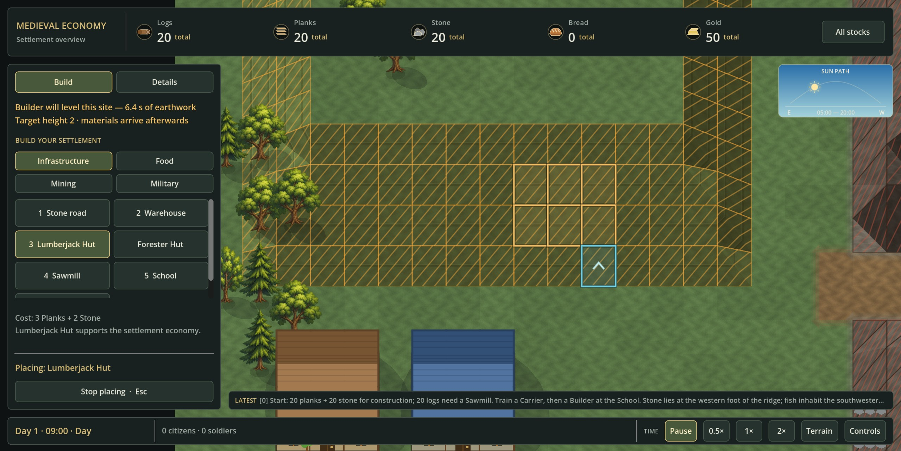
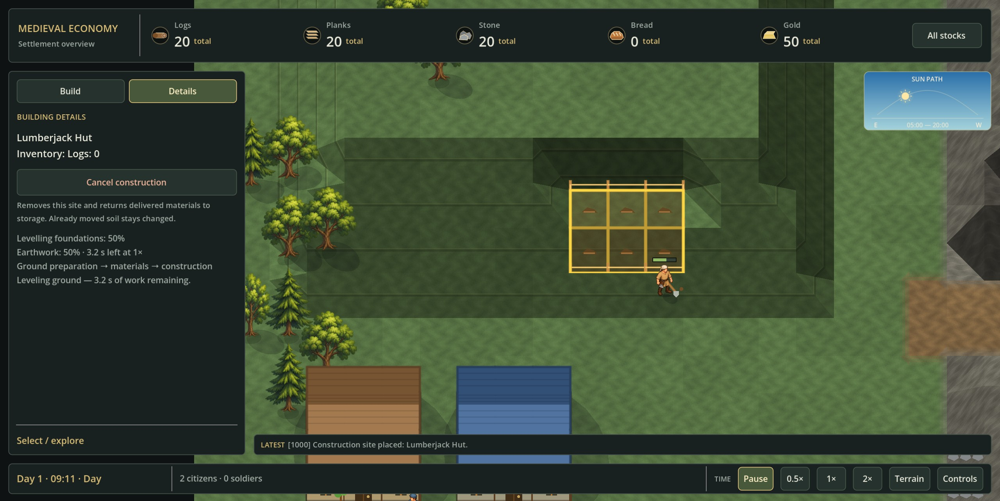

# Builder foundation preparation — 2026-09-06

New economy construction on a gentle slope now has three physical stages:
**Builder ground preparation → Carrier materials → Builder construction**.
The existing map shape, 40 × 40 projection, height scale, building masks,
resource prices and ordinary construction time are unchanged.

## Player behavior

Choose a building and hover over clear, gently uneven ground. A gold preview
shows the full footprint, required earthwork time at 1× and final height.
The blue exterior entrance stays accessible. Gold terrain hatching is a
general slope hint, not permission for every building: the full preview
checks the actual mask, nearby objects and future ground changes.

Clicking reserves the building mask and places low survey stakes. It does
not move any soil. Train a Builder at the School: that citizen walks to the
site and works outside it, visibly changing shared terrain corners. Materials
are requested only after the whole foundation is level. A flat site skips
preparation and uses the original delivery/construction sequence.

The inspector separates ground-preparation progress from ordinary construction.
A working Builder has a simple shovel cue. Hunger and occupied ground
pause real work. Saved games retain partially completed earthwork.
Cancelling releases the site and worker, using existing material-refund rules;
already completed soil changes remain. There is no additional soil resource fee.

## Initial limits and safety

- Only modern multi-cell, economy-enabled sites can be prepared. Legacy
  one-cell authoring and economy-disabled instant placement remain flat-only.
- The height span over all unique occupied-mask vertices must be at most
  **2 prototype height units**. This is an initial project tuning value,
  not a claimed original KaM threshold.
- The target is the rounded mean of those unique vertices. Each height unit
  takes **8 working simulation ticks** (0.8 seconds at 1×), processed in
  north-to-south, then west-to-east order. A six-cell Hut can require different
  amounts of work depending on the ground, not just its size.
- No shaping of water, rock, other foundations, entrances, trees, fields or
  deposits. Existing outside walkable connections and roads must remain usable
  throughout the sequence, not only at the final height.
- Nearby future affected ground is protected from new permanent objects and
  authoring edits until it no longer needs changing. Citizens can still cross
  it; the Builder waits for other citizens and their visible steps to clear.
- The ordinary terrain editor remains unable to reshape an occupied building.
  Foundation writes have a separate owner-checked path and change one height
  unit at a time, using the existing local terrain/cache invalidation.

Fields are still flat-ground placements. Large terraforming, retaining walls,
soil transport and a more natural reference-inspired map are separate work.

## Implementation and saves

`building_foundations.gd` owns the pure plan, ordered safety checks and work.
SimulationWorld exposes `foundation_plan` and `foundation_affects_cell`.
The existing exclusive `build_site` task requires a physically arrived Builder;
preparation cannot run from a preview, placement, a distant worker or a load.

Save **v17** adds `foundation_target_height`, `foundation_work_total` and
`foundation_work_remaining` per building. Remaining geometry must equal
`ceil(remaining / 8)` outstanding height units. Pending sites cannot contain
delivered construction materials or advanced construction. Validation runs
transactionally and checks surrounding objects after all layers have loaded.
Versions 1–16 retain their original terrain, materials and progress with no
synthetic preparation. Footprint geometry remains version 1; legacy shapes
remain version 0.

## Verification

Dedicated suites add 13 simulation, nine save and six real-scene UI cases.
Coverage includes real Builder/Carrier completion, no-Builder and no-material
controls, cancellation before/during preparation, two-Builder exclusivity,
dynamic obstructions, future surface reservations, JSON
checkpoints, malformed saves and actual pointer placement/picking.

Native Godot verification on the unchanged starter landscape placed a Hut at
(10, 10), requiring 64 work ticks. A real Builder prepared it; a Carrier then
delivered exactly 3 planks and 2 stone and the Builder finished construction.
The inspected images show the actual preview and halfway earthwork:

