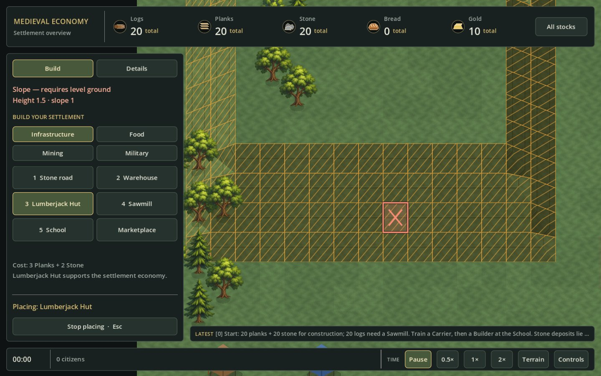
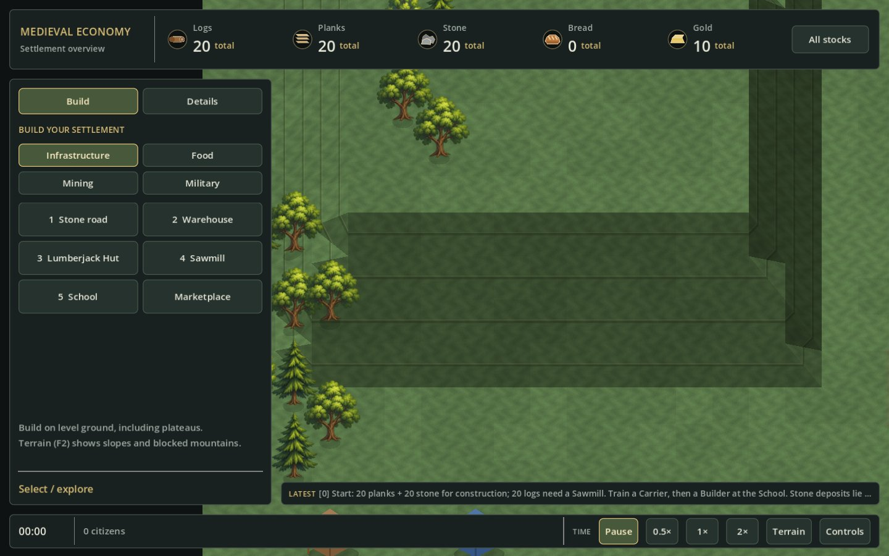

# Square terrain and slope feedback — 2026-09-05

## Request and scope

Use 40 × 40 ground cells, matching the unrotated grid proportions inspected in
KaM Remake. Make a hillside recognizable before the player attempts to place a
building. The earlier 56 × 34 view compressed the map vertically.

The new flat projection is `screenX = 40*x`, `screenY = 40*y`; relief still
subtracts `8*height` from screen Y. Coordinates, map size, saved heights, slope
limits, movement speed, resource costs and construction rules are unchanged.
No camera yaw, new raster assets or automatic terrain levelling are introduced.

## Visual feedback

- Normal view combines directional lighting with subtle, actual-height surface
  cues on slopes. A level plateau does not receive slope markings.
- Building and field placement temporarily highlights unsuitable terrain with
  a pattern, not color alone. This aid is independent of the manual F2 overlay.
- The hovered ground tile gets a placement outline and an explicit reason when
  invalid, including the level-ground requirement on slopes. A valid plateau is
  accepted; a gentle slope can still carry a road.
- Pointer feedback is presentation-only. It does not reserve a tile, consume
  resources, edit the event log or change saved simulation state.
- Moving over the HUD or outside the map, leaving placement mode and changing
  the world clear stale pointer feedback.

## Rendering contract

Height cues follow the existing shared-corner triangles and are retained with
the base-terrain cache. Road wear continues to update only surface cells;
camera movement and hover feedback must not trigger a full terrain rebuild.
Terrain and object rows keep their existing depth ordering. No dependency on
the previous 56 × 34 dimensions remains in projection-specific fixtures.

The existing construction cancellation, price compatibility, starter-economy
and render-performance work is preserved. Run `./tests/run-headless.sh` for
the full regression suite; native game captures verify normal, invalid-slope,
valid-plateau and road-on-slope presentation.

## Native verification — 2026-09-05

The actual Godot window was inspected in normal view, with a rejected building
on a grassy slope, with an accepted building on the raised plateau, and with a
road allowed on that same gentle slope. The building view displays a red X
and `Slope — requires level ground` before any placement click.

A 900-frame native smoke profile of the populated relief map on Mac M4 at
1440 × 900 measured 11.37 ms mean / 15.48 ms p95 per frame (approximately
88 frames/s by reciprocal mean). Terrain rows redrew only 42 times while
road wear evolved, not every frame. In the subsequent 240-tick cache check,
zero base-terrain cells were rebuilt; 140 surface cells updated. This is a
single development-machine smoke measurement, not a hardware guarantee.

