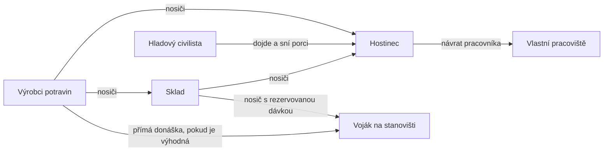

# Potraviny pro civilisty a vojáky — analýza implementace

**Datum: 5. 9. 2026. Stav: návrh k diskusi, bez změny herních pravidel.**

**Následná implementace 5. 9. 2026:** uživatel vybral civilní pohostinec a fyzickou
vojenskou donášku podle KaM. Aktuální pravidla jsou v [popisu implementace](food-and-military-supply.md).
Níže zůstává původní analýza včetně alternativ, které nebyly všechny realizovány.

Doporučuji rozvinout model blízký Knights and Merchants: **civilisté automaticky chodí do hostinců, vojákům nosič doručuje jídlo na jejich stanoviště**. Obě skupiny sdílejí výrobu a fyzické zásoby. Velikost osady a armády tak omezuje schopnost vyrábět a doručovat potraviny.

V našem projektu už základ hladu, potravinových řetězců i hostince existuje. Nejdůležitější další práce je oddělit armádní zásobování, zpřesnit přerušování práce a rezervace a sladit spotřebu s rychlostí ekonomiky.

## 1. Co přebíráme z Knights and Merchants

Původní manuál The Peasants Rebellion popisuje automatické návštěvy hostince u civilistů a donášku jídla vojákům po rozkazu hráče. Jeden kus jídla vojáka plně nasytí, zatímco civilistům různé potraviny obnovují různou část sytosti. Rekrut ve strážní věži chodí do hostince; po dobu jeho nepřítomnosti zůstává věž neobsazená. To jsou vhodné rozdíly i pro naši hru. [Manuál, tištěné strany 21, 46, 60 a 67](https://www.knightsandmerchants.net/application/files/7315/6828/9445/manual_tpr_160_eng.pdf).

Přesnější mechanické hodnoty ověřuji proti veřejnému **KaM Remake**, revizi `a3b3e5268e1475460e4561f9143df6f1a532e681`, kterou má projekt lokálně v `reference/kam_remake`. Remake od původní hry odlišuji: například víno v něm obnovuje 30 %, zatímco komentář zdroje uvádí pro původní KaM 20 %.

| Pravidlo | KaM Remake v ověřené revizi | Doporučení pro naši první verzi |
|---|---|---|
| Civilní jídlo | Hostinec, nejvýše dvě různé potraviny za návštěvu | Zachovat |
| Pořadí potravin | Chléb → klobása → víno → ryba | Zpočátku zachovat, zpřístupnit v datech |
| Výživnost | Chléb 40 %, klobása 60 %, víno 30 %, ryba 50 % | Zachovat poměry |
| Hostinec | Šest míst, konzumace nějakou dobu trvá | Rozvinout pobyt uvnitř o šest míst; čas samostatně ladit |
| Voják | Jeden doručený kus kteréhokoli ze čtyř jídel → plná sytost | Zachovat jako jednoduchou vojenskou dávku |
| Objednávka vojáka | Pod 55 % sytosti, nejvýše jeden nevyřízený požadavek | Zachovat ochranu proti duplicitám |
| Automatické zásobování hráče | Samotný hlad nenahrazuje hráčův rozkaz | Nabídnout automatiku jako naše rozšíření |

Zdroje: [hodnoty kondice a jídel](https://github.com/reyandme/kam_remake/blob/a3b3e5268e1475460e4561f9143df6f1a532e681/src/common/KM_Defaults.pas#L380), [návštěva hostince](https://github.com/reyandme/kam_remake/blob/a3b3e5268e1475460e4561f9143df6f1a532e681/src/units/tasks/KM_UnitTaskGoEat.pas#L99), [objednávka vojáka](https://github.com/reyandme/kam_remake/blob/a3b3e5268e1475460e4561f9143df6f1a532e681/src/units/KM_UnitWarrior.pas#L290), [předání vojenské dávky](https://github.com/reyandme/kam_remake/blob/a3b3e5268e1475460e4561f9143df6f1a532e681/src/units/tasks/KM_UnitTaskDelivery.pas#L517).

Smyslem inspirace je prostorová ekonomika: vzdálená pekárna, špatná cesta nebo přetížení nosiči mají skutečné následky. Pestrost potravin zároveň zkracuje počet návštěv hostince. Samostatná žízeň, vitamíny nebo morálka nejsou pro tento základ potřeba.

Kapacitu šesti jídelních míst definuje samostatně [implementace hostince](https://github.com/reyandme/kam_remake/blob/a3b3e5268e1475460e4561f9143df6f1a532e681/src/houses/KM_HouseInn.pas#L11). Rezervace porcí a pořadník navržené níže jsou naše rozšíření; reference při výběru pouze kontroluje aktuální místo a jídlo.

## 2. Co už je v projektu

Audit vychází ze skutečných souborů pracovního adresáře, nikoli pouze ze starší dokumentace.

| Oblast | Zjištěný stav |
|---|---|
| Výroba | Fungují chléb, klobásy, víno a ryby včetně fyzických přesunů mezi budovami |
| Sytost | Všechny entity ve `world.workers`, včetně vojáků, mají `hunger`; vyšší hodnota znamená větší sytost |
| Hlad | Při zapnuté ekonomice ubývá bod každých deset simulačních ticků; při nule je jednotka odstraněna |
| Hostinec | Hladová volná jednotka bez nákladu vybere dosažitelný zásobený hostinec a při příchodu okamžitě spotřebuje nejvýše dvě různé potraviny. Souběžně doplněný vstup dovnitř přidává krátký pobyt šesti ticků, nikoli kapacitu jídelních míst |
| Pracovní místo | Specialista má trvalé `home_id`; návštěva hostince mu zaměstnání nepřiděluje znovu |
| Výroba během nepřítomnosti | Zpracování receptu potřebuje operátora; rozpracovaná dávka může počkat a pokračovat bez nového odečtení vstupů |
| Armáda | Funguje vybavení fyzického rekruta a vznik vojáků; vlastní přesuny armády, formace a boj zatím chybějí |
| Jídlo vojáků | Používají civilní návštěvu hostince. Donáška k vojákovi neexistuje |
| Ukládání | Sytost i nesený materiál se ukládají; chybí trvalý stav potravinové rezervace či vojenské zásilky |

Hlavní místa kódu: [ClassicEconomy — `tick_needs`, `handle_idle`, `arrive`](../game/scripts/simulation/classic_economy.gd), [SimulationWorld — `_tick_worker`, `_tick_buildings`, `_ware_destination`](../game/scripts/simulation/simulation_world.gd), [Workplaces](../game/scripts/simulation/workplaces.gd), [WorldSnapshot](../game/scripts/simulation/world_snapshot.gd).

**Pozor na dvě odlišné kapacity:** dnešní `inn.input_capacity = 6` znamená šest kusů **od každé potraviny**, tedy až 24 kusů. Není to šest míst pro hosty. U hostince jsou také duplicitní nastavení pořadí a počtu jídel; vykonávaný kód používá `economy.json`. Při rozšíření potřebujeme jedno autoritativní nastavení.

## 3. Doporučené chování jednotek

Šipky zboží vždy představují skutečnou cestu nosiče. Součet potravin v horním panelu sám o sobě nikoho nenakrmí.

### Civilisté: jídlo je součást pracovního dne

To zahrnuje nosiče, stavitele, všechny výrobní profese i rekruty. Nosiči a stavitelé zůstávají společnými pracovníky; specialisté si zachovají svou budovu.

1. Při hladu jednotka dokončí krátkou rozpracovanou činnost nebo běžnou dodávku. Další práci už nepřijme, pokud je jídlo dostupné.
2. Vybere hostinec podle dosažitelnosti, času cesty a očekávaného čekání. Zarezervuje se jedna konkrétní dostupná porce a místo v pořadníku, nikoli okamžitě židle na celou dobu pochodu.
3. Uvnitř obsadí jedno ze šesti míst. Porce se odečte a sytost obnoví při zahájení její konzumace; následný čas jídla drží místo obsazené. Načtení hry tento krok nesmí opakovat.
4. Pokud nedosáhla cílové sytosti, může sníst druhý odlišný druh. Ten se rezervuje až při výběru, aby si vzdálený host neblokoval zbytečně dvě porce.
5. Uvolní místo a vrátí se ke svému zaměstnání. Rozpracovaná výroba pokračuje ze zachovaného stavu.

**Výjimky jsou podstatnější než samotný ukazatel hladu.** Dnes nosič s nedoručitelným nákladem nemůže jít jíst. Doporučuji při kritickém hladu dovolit přerušení i s nákladem: ten zůstane fyzicky u jednotky, nespotřebuje se automaticky a po jídle se doručí nebo přesměruje do skladu. Jeho původní příjemce a rezervace musí mít jasně určený stav. Běžný chod nadále nejprve dokončí dodávku.

Pokud jídlo dostupné není, nesmějí všichni hladoví bezúčelně čekat před prázdnou hospodou. Nosiči mohou zajišťovat jídlo a výrobní vstupy, potravináři pokračovat ve výrobě. Při kritické sytosti dostanou tyto úkoly přednost. Zpomalení hladových nosičů bych na začátku nepřidával: zhoršovalo by možnost dostat se z nedostatku.

Rezervace porce potřebuje platnost odvozenou z očekávané cesty. Změna cíle, dlouhodobě zablokovaná cesta nebo smrt rezervaci uvolní. Pořadník zohlední kritický hlad a dobu čekání; dvě jednotky nemají dostat slib téže poslední porce.

### Vojáci: jídlo přichází za nimi

První proveditelný krok je donáška **stojícímu jednotlivému vojákovi**. To lze ověřit už nad současnou ekonomickou rekrutací. Skupinové ovládání bude až tenká vrstva nad jednotlivými příjemci, jakmile vznikne výběr armády a rozkazy.

- Jednotka se v datech výslovně označí režimem `inn` nebo `delivery`. Samotné zařazení mezi společné `workers` nesmí rozhodovat o způsobu jídla.
- Požadavek patří stabilnímu ID vojáka. Nosič rezervuje konkrétní kus ve skladu nebo výstupu výrobce, dojde pro něj a doručí jej na dosažitelné sousední místo příjemce.
- Jedna dávka plně nasytí vojáka. Zpočátku nemají jezdci zvláštní spotřebu obilí pro koně; to by byl další samostatný systém.
- Vojáci nevybírají zásoby z inventáře hostince. Civilní zásobu chrání i rozdělování nových dodávek mezi hostince a armádu.
- Smrt nebo zrušení příjemce uvolní požadavek. Již nesenou dávku lze přiřadit jinému potřebnému vojákovi, jinak se fyzicky vrací do skladu.
- Pozdější přesun vojáka vyvolá přepočet cesty s omezenou četností. Pokud není dlouhodobě dosažitelný, zásilka přestane cíl pronásledovat a dostane nový úkol.

Pro ovládání doporučuji **„Zásobit“ + přepínač „Automaticky zásobovat“**. Ruční rozkaz může pracovat s referenčním prahem 55 %. Automatika by v prvním pokusu požadovala jídlo například při 30 %, aby neplýtvala průběžným doplňováním skoro sytých jednotek. Oba prahy jsou samostatná nastavení; automatika je náš návrh, nikoli tvrzení o původním KaM.

Dokud neexistuje boj, nemáme jak pravdivě vyhodnotit bezpečnou trasu ani přerušení předávání během střetu. První etapa proto slibuje dosažitelnou cestu a doručení stojícímu příjemci. Později doporučuji předávat mimo aktivní boj a umožnit hráči zásobování oddílu vypnout.

## 4. Potravinové řetězce a jejich význam

| Potravina | Existující výrobní cesta | Úloha v ekonomice |
|---|---|---|
| Chléb | Pole → farma → obilí → mlýn → mouka → pekárna; 1 mouka → 2 chleby | Obnovitelný základ s několika profesemi a přepravními úseky |
| Klobásy | 4 obilí → prase + kůže; 1 prase → 3 klobásy | Vysoká civilní výživnost; chov současně podporuje koženou výzbroj |
| Víno | Vinice → sklizeň vinařem/farmářem → víno | Kratší řetězec, nízká civilní výživnost, dobrá vojenská dávka |
| Ryby | Konečné hejno → rybář → rybářská chata | Rychlý lokální začátek; omezený zdroj nutí později změnit zásobování |

Výrobní poměry a implementaci dokládají [recepty](../game/data/recipes.json), [budovy](../game/data/buildings.json) a [současný ekonomický popis](economy-expansion.md).

Pravidlo „vojákovi stačí libovolný kus“ dělá z vína zajímavou armádní potravinu. Klobásy se vyplatí nechávat civilistům. Je to srozumitelné rozhodnutí pro hráče, ale musíme sledovat, zda víno všechny ostatní vojenské dodávky prakticky nevytlačí. Pokud ano, můžeme později zkusit stejnou výživnost pro obě skupiny. V první verzi bych obě pravidla nemíchal.

Obilí už soupeří o mlýny, vepříny a stáje. Proto potřebujeme prioritizaci **celého zásobování**, nikoli jen vysokou prioritu hotového chleba. Prázdná pekárna nic neupeče, pokud všechen nosičský čas spotřebují dodávky hotových jídel na druhý konec mapy.

## 5. Tempo hladu: hlavní otázka vyvážení

Současná data: maximum 2700, počáteční sytost 1620, vyhledávání jídla při 360. Simulace má deset ticků za herní sekundu, pokles je jeden bod za deset ticků.

| Událost | Současné herní minuty | Reálný čas při výchozím tempu 0,5× |
|---|---:|---:|
| Nová jednotka poprvé hledá jídlo | přibližně 21 | přibližně 42 min |
| Nová jednotka bez jídla zemře | přibližně 27 | přibližně 54 min |
| Od prahu hladu do smrti | 6 | 12 min |
| Plná sytost do smrti | 45 | 90 min |

Výpočet vychází z [economy.json](../game/data/economy.json) a pevného kroku i výchozí rychlosti v [main_view.gd](../game/scripts/view/main_view.gd). Skutečné vyhledání může odložit rozpracovaná činnost; přetížená simulace může prodloužit reálný čas.

Pro krátké hraní tak jídlo dlouho téměř není vidět. Zároveň pekárna zpracuje dávku za deset herních sekund. **Referenční hladové hodiny a naše zrychlená výroba zatím nejsou společně vyvážené.**

Doporučuji dva srovnávací scénáře, bez automatické změny stávajících uložených her:

- **Referenční tempo:** současné hodnoty, dlouhé budování města.
- **Rychlejší prototyp:** třikrát rychlejší úbytek sytosti. První hlad přibližně za sedm herních minut, smrt nové jednotky bez jídla za devět, rezerva od běžného hladu dvě minuty. Test musí ověřit, zda delší cesty tuto rezervu nevyčerpají.

Zrychlení realizovat explicitní celočíselnou rychlostí úbytku, ne prostým zaokrouhlením intervalu deseti ticků na tři. Parametry musí patřit ke scénáři/uložené hře a ukazatele v UI číst stejné hodnoty.

Pro orientaci: při dnešním tempu přidá chléb 18 herních minut života. Třicet civilistů tedy v dlouhém ustáleném provozu potřebuje přibližně **1,67 chleba za herní minutu**; při trojnásobném úbytku pět. Jde o model pouze s chlebem, bez ztrát a ořezu přebytku sytosti. Teoretické maximum samotné pekárny je 12 chlebů za minutu, ale reálný výstup omezují obilí, mouka, obsluha, doprava a kapacita výstupu. Z těchto čísel nelze vyvodit skutečný počet uživených lidí bez měření celé osady.

Výchozí testovací mapa nyní nemá žádné jídlo ani hostinec. Má dvě hejna po 40 rybách. Se zrychleným hladem je nutné znovu ověřit postup škola → nosič/stavitel → hostinec a rybářství, případně do nového testovacího scénáře přidat konečnou počáteční zásobu. Starším uloženým hrám se zásoby bez rozhodnutí hráče nepřidávají.

## 6. Jak změnu rozdělit v kódu

Největší práce bude v životním cyklu úkolů a ukládání. Pouhé přidání dalšího ukazatele nestačí. Přitom není důvod přepisovat celou simulaci do nové architektury.

| Část | Doporučená odpovědnost a napojení |
|---|---|
| `NeedsSystem` | Vyčlenit ze `ClassicEconomy` pokles sytosti, prahy a události. Sytost držet odděleně od budoucích životů a výdrže |
| `FeedingSystem` | Civilní návštěva, porce, místa, čekání; vojenské požadavky. Rozhoduje podle explicitního režimu jednotky |
| `TaskBoard` a logistika | Rozšířit zásilku o typ a ID příjemce, zdroj, rezervovanou potravinu, vykonavatele a fázi. Stávající fyzický transport budova → budova znovu použít |
| `SimulationWorld` | Bezpečné přerušení/návrat, přechody mezi cestou a pobytem uvnitř, předání vojákovi a jednotný cleanup odstraněné entity |
| `Workplaces` | Zachovat přidělení specialisty i stráže během jídla a čekání |
| `WorldSnapshot` | Uchovat význam rozpracované návštěvy a zásilky; cestu lze po načtení znovu spočítat |
| HUD | Oddělit civilisty/vojáky, zobrazit příčinu nedostatku a průběh zásobení |

Nová zásilka by měla minimálně vědět: `recipient_kind`, `recipient_id`, `source_building_id`, `ware`, `carrier_id`, `phase`, `created_tick`. Jedna aktivní zásilka nakrmí právě jednoho vojáka. Požadavek bez zásob může čekat bez rezervace neexistujícího kusu. Po vyzvednutí je kus pouze v nákladu nosiče; není současně ve skladu ani už spotřebovaný.

Rezervace nejsou další inventář. Platí `volné kusy = fyzické kusy − platné rezervace`. Před odečtením se rezervace zkontroluje a převede na nesený kus nebo snědenou porci. Podle fáze se ukládá i to, zda už sytost byla připsána.

Při auditu probíhala souběžná změna pobytu jednotek uvnitř budov a snapshotu z v11 na v12 (`inside_building_id`, `indoor_wait_ticks`). Stravování musí navázat na dokončené řešení interiérů; nevytvářet druhý paralelní systém vstupu. Číslo další verze uložené hry určit až při implementaci.

### Rizika, která musí první verze vyřešit

- **Poslední porce:** několik lidí vyrazí do stejného hostince, ale jídlo stačí jen jednomu. Řešení: rezervace a čekací pořadí, ne další globální počítadlo.
- **Zablokovaný hostinec:** dnešní akce `eat` bez běžného úkolu nemusí opustit neúspěšný cíl. Po ztrátě dosažitelnosti uvolnit rezervaci a znovu vybrat cíl, s prodlevou mezi hledáními.
- **Hlad s nákladem:** povolit popsanou nouzovou návštěvu při zachování zboží; běžné dodávky zbytečně nepřerušovat.
- **Dvojí spotřeba po načtení:** uložit fázi a už provedenou konzumaci, nikoli pouze `hunger`.
- **Hromadný hlad:** prioritě se musí přičítat čekání; časté A* hledání pro každého hladového v každém ticku nahradit událostmi, intervalem opakování a cache dosažitelnosti.
- **Smrt s nákladem:** dnes náklad zaniká. Pro první verzi může zůstat explicitní ztrátou vykázanou v ekonomických statistikách; fyzické balíky na zemi by byly další rozšíření. Ve všech případech uvolnit porce, sedadla, zásilky, úkoly a prostorové rezervace.

## 7. Co musí být vidět hráči

Jídlo má vytvářet čitelné problémy. Hlášení „jednotka hladoví“ samo nevysvětlí, zda je potřeba další farma, nosič nebo průchodná cesta.

| Pohled | Užitečná informace |
|---|---|
| Jednotka | Sytost, „dokončuje dodávku před jídlem“, „jde do hostince“, „jí“, „čeká na zásobení“ |
| Výrobní budova | Přidělený pracovník zůstává 1/1; odděleně „pracovník je na jídle, výroba čeká“ |
| Hostinec | Fyzická a rezervovaná zásoba, obsazenost, počet čekajících |
| Armáda | Počet hladových, počet dávek na cestě, automatické zásobování, rozkaz „Zásobit“ |
| Osada | Jedlé zásoby oddělené od obilí/mouky/prasat; civilní a vojenská spotřeba, trend a kritická místa |

„Potraviny vystačí na X minut“ zobrazovat až po získání skutečné spotřeby a označit jako odhad. Vinařský sklad na odříznuté straně mapy není dostupná zásoba místního hostince. Globální součet proto doplnit lokálními upozorněními. Kritické události sdružovat, ne hlásit jednotlivě každého vojáka v každém ticku.

## 8. Pořadí implementace a ověření

| Etapa | Výsledek pro hráče | Relativní náročnost |
|---|---|---|
| 1. Civilní stravování | Viditelná návštěva hostince, místa a porce, návrat specialisty, nouzový hlad s nákladem; odpovídající save/load | Střední |
| 2. Stojící vojáci | Skutečný nosič s jednou dávkou ke konkrétnímu vojákovi, žádné návštěvy hospody; automatický požadavek pro test | Vyšší — nový typ cíle logistiky |
| 3. Ovládání a rovnováha | Hromadné zásobení po zavedení vojenského výběru, přepínač automatiky, rozdělení civilních/vojenských dodávek, porovnání temp | Střední až vyšší |
| 4. Polní armáda | Přesouvající se příjemci, vazba na boj, případně polní sklady a zásobovací vozy | Závisí na budoucím vojenském systému |

První dvě etapy tvoří smysluplný celek pro oba druhy jednotek. Polní kuchyně, vozy, morálka, kažení jídla a samostatné krmení koní mají přijít až podle výsledku hraní.

Ověření musí zahrnovat zejména:

1. Dvě hladové jednotky a poslední porci; plný hostinec; změnu dosažitelnosti během cesty.
2. Hladového nosiče s nedoručitelným nákladem a návrat specialisty do stejného pracoviště, včetně rozpracované dávky.
3. Prázdný hostinec s dostupným jídlem ve skladu i úplný nedostatek, z něhož se pracovníci ještě dokážou dostat.
4. Každý ze čtyř druhů jídla, dvě různé civilní porce a jednu plnou vojenskou dávku bez dvojí spotřeby.
5. Zánik příjemce, opakovaný vojenský rozkaz a uvolnění všech souvisejících rezervací.
6. Uložení před vyzvednutím, s nesenou dávkou a během jídla; po načtení stejnou zásobu, sytost i dokončení dodávky.
7. Delší běh s 30 civilisty a 20 vojáky ve dvou tempech; měřit jídla/minutu, obsazenost hostinců, čas mimo práci, vytížení nosičů a vyčerpané ryby.

Současné [testy základní ekonomiky](../game/tests/classic_economy_tests.gd) už obsahují restorace potravin, limit dvou jídel, smrt a návštěvu hostince strážným. [Testy pracovišť](../game/tests/workplace_tests.gd) ověřují zachování domova. Nové případy mají rozšířit tyto scénáře o konkurenci, zásilky a přerušení.

**Meze ověření této analýzy:** provedena kontrola kódu, dat, referenčních zdrojů a přepočet časování. Závěrečný běh současné testovací sady dne 5. 9. 2026 ohlásil **320/320**, ale log současně obsahoval chyby typu pole při volání `_begin_worker_move`. Výsledek proto nepovažuji za čistě úspěšné ověření. První běh navíc zachytil přechodně nesladěné rozhraní souběžně upravovaných interiérů. Tyto chyby je potřeba odděleně dořešit před implementací jídla; nejsou důkazem vady navrženého potravinového modelu. Nové navržené chování nebylo implementováno ani herně otestováno.

## 9. Doporučený výchozí směr

Začal bych KaM principem **civilista jde za jídlem, jídlo jde za vojákem**, čtyřmi již existujícími potravinami a zachováním skutečné logistiky. Pro armádu bych připravil automatické zásobování s možností ručního doplnění. Smrt hladem bych zatím zachoval jako stávající pravidlo, doplněné včasnými a vysvětlujícími upozorněními; bojové postihy bych řešil společně s bojem.

Největší rozhodnutí pro následující hraní jsou **pomalejší budování versus rychlejší potravinový tlak** a **kolik přímé kontroly má vyžadovat armádní zásobování**. Navržené rozdělení dovoluje oba směry porovnat bez přepisování výrobních řetězců.
